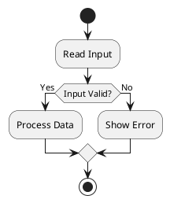

Question: What is a PUML flow graph?

Answer:

**PUML** usually refers to **PlantUML**, a text-based language for creating diagrams from plain text. A **PUML flow graph** generally means a **flowchart** written in PlantUML syntax.

Instead of drawing boxes and arrows manually, you write a text file (often with a `.puml` extension), and PlantUML generates the diagram automatically.

For example, this simple flow graph:

```
Start
  ↓
Read Input
  ↓
Is Input Valid?
   ├── Yes → Process Data → End
   └── No  → Show Error → End
```

can be written in PlantUML as:



This generates a flowchart like:

```
     Start
        |
        v
 +---------------+
 | Read Input    |
 +---------------+
        |
        v
 +----------------+
 | Input Valid?   |
 +----------------+
     /       \
   Yes       No
    |         |
    v         v
+---------+ +------------+
| Process | | Show Error |
+---------+ +------------+
     \        /
      \      /
       v    v
        End
```

## Why developers use PUML

PlantUML is popular because it:

* **Lives in Git** – diagrams are just text files, so they can be version-controlled.
* **Works well with AI** – LLMs can easily generate and edit PlantUML.
* **Supports many diagram types**, including:

  * Flowcharts
  * Sequence diagrams
  * Class diagrams
  * Activity diagrams
  * State diagrams
  * ER diagrams
  * Mind maps
  * Gantt charts
  * Architecture diagrams

## Example: LLM inference pipeline

Here's a slightly more realistic example:

```puml
@startuml
start

:Receive Prompt;
:Tokenize;

:Run Transformer Layers;

if (EOS Token?) then (Yes)
    :Return Response;
    stop
else (No)
    :Generate Next Token;
    :Append Token;
endif

repeat while (Not Finished?)

@enduml
```

This represents:

```
User Prompt
      |
      v
 Tokenize
      |
      v
 Transformer
      |
      v
 Predict Next Token
      |
      v
 EOS?
 ├── Yes → Return Response
 └── No  → Append Token → Repeat
```

## PUML vs. Mermaid

| Feature                     | PlantUML (PUML) | Mermaid |
| --------------------------- | --------------- | ------- |
| Format                      | Text            | Text    |
| Git-friendly                | ✅               | ✅       |
| AI-generated                | ✅               | ✅       |
| UML support                 | Excellent       | Basic   |
| Flowcharts                  | ✅               | ✅       |
| Sequence diagrams           | Excellent       | Good    |
| Class diagrams              | Excellent       | Basic   |
| Large software architecture | Better          | Simpler |

In many software engineering teams, especially for documenting system architecture or object-oriented designs, PlantUML is often preferred because it has much richer UML support.

If you're learning AI systems or LLM infrastructure, PUML is a useful way to document pipelines such as:

* Training workflow
* Transformer forward pass
* RAG architecture
* Agent workflows
* Model serving pipelines
* CI/CD deployment flows

Many engineers keep these `.puml` files alongside their source code so that both the implementation and its diagrams stay synchronized.