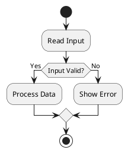

问题：什么是PUML流程图？

答案：

**PUML** 通常指 **PlantUML**，这是一种基于文本的语言，用于通过纯文本创建图表。**PUML流程图** 一般指用 PlantUML 语法编写的**流程图**。

无需手动绘制方框和箭头，只需编写一个文本文件（通常以 `.puml` 为扩展名），PlantUML 便会自动生成图表。

例如，下面这个简单的流程图：

```
开始
  ↓
读取输入
  ↓
输入是否有效？
   ├── 是 → 处理数据 → 结束
   └── 否 → 显示错误 → 结束
```

可以用 PlantUML 写成：



这会生成类似如下的流程图：

```
    开始
        |
        v
 +---------------+
 |   读取输入    |
 +---------------+
        |
        v
 +----------------+
 | 输入是否有效？ |
 +----------------+
     /       \
   是         否
    |         |
    v         v
+---------+ +------------+
| 处理数据 | | 显示错误   |
+---------+ +------------+
     \        /
      \      /
       v    v
       结束
```

## 开发人员为何使用 PUML

PlantUML 受欢迎的原因包括：

* **存在于 Git 中** – 图表只是文本文件，因此可以进行版本控制。
* **与 AI 配合良好** – LLM 可以轻松生成和编辑 PlantUML。
* **支持多种图表类型**，包括：

  * 流程图
  * 时序图
  * 类图
  * 活动图
  * 状态图
  * ER 图
  * 思维导图
  * 甘特图
  * 架构图

## 示例：LLM 推理流水线

下面是一个更实际的例子：

```puml
@startuml
start

:Receive Prompt;
:Tokenize;

:Run Transformer Layers;

if (EOS Token?) then (Yes)
    :Return Response;
    stop
else (No)
    :Generate Next Token;
    :Append Token;
endif

repeat while (Not Finished?)

@enduml
```

这表示：

```
用户提示
      |
      v
   分词
      |
      v
 Transformer
      |
      v
 预测下一个 Token
      |
      v
 EOS?
 ├── 是 → 返回响应
 └── 否 → 追加 Token → 重复
```

## PUML 与 Mermaid 对比

| 特性                     | PlantUML (PUML) | Mermaid |
| ----------------------- | --------------- | ------- |
| 格式                     | 文本            | 文本    |
| 支持 Git                | ✅               | ✅       |
| 可 AI 生成              | ✅               | ✅       |
| UML 支持                | 优秀            | 基础    |
| 流程图                  | ✅               | ✅       |
| 时序图                  | 优秀            | 良好    |
| 类图                    | 优秀            | 基础    |
| 大型软件架构            | 更优            | 更简单  |

在许多软件工程团队中，尤其是在记录系统架构或面向对象设计时，PlantUML 通常更受青睐，因为它提供了更丰富的 UML 支持。

如果你正在学习 AI 系统或 LLM 基础设施，PUML 是一种记录以下流水线的有用方式：

* 训练工作流
* Transformer 前向传播
* RAG 架构
* Agent 工作流
* 模型服务流水线
* CI/CD 部署流程

许多工程师会将这些 `.puml` 文件与源代码放在一起，以便实现和其图表保持同步。
